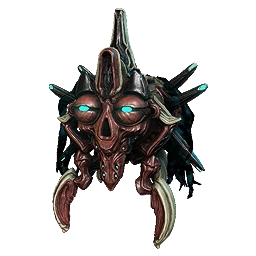

# Eidolon Guide

## What are Eidolons?

Eidolons are Sentient bosses that roam the Plains of Eidolons during night time cycle. These bosses drop a series of rewards that can be very beneficial in many ways, Read down or check other tabs for more information!

## Eidolon Vomvalyst

Eidolon Vomvalyst are small sentient creatures that roam around the Plains of Eidolon during the night time cycle, these creatures roam in packs of 2-3, or can be found with the Teralyst/Gantulyst/Hydrolyst.  
Here are a few notable things about them,

* Possess two forms, Physical form and Energy Form.
* Physical Form can be damaged like any normal enemy.
* Energy Form can only be killed by your operator's void energy attacks.
* Regenerate back into Physical form once they have been in Energy Form for a period of time.
* Can be sucked up into Eidolon Lures.

## Eidolon Lures

Eidolon Lures are Grineer machines found in the Plains of Eidolon at Grineer encampments during night time cycle. These can be hacked with Ciphers, so it is recommended to get some for these guys.   
Here are a few notable things about them,

* Prevent teleportation of the eidolon Teralyst/Gantulyst/Hydrolyst once charged.
* Takes a total of 3 Vomvalyst to charge one.
* Can be held position to give to another squad mate.
* Ciphers work on them.

## Eidolon Teralyst

Eidolon Teralyst is the first boss you encounter when night time is present, This eidolon has a series of attacks that can do moderate damage.  
Here are a few notable things about them,

* All of their attacks can easily be dodged.
* Has a blue column of light to indicate it's spawn location.
* Has a total of 4 synovias/limbs.
* Takes a total of 2 charged lures to capture the Teralyst.
* Weak to Radiation damage if armor is kept, like stated in the "Required Builds" section.

With that being said, this Eidolon also has a lot more rewards then a Vomvalyst,  
Here are the rewards.

#### If killed

* 1x Eidolon Shard
* Sentient Cores
* 1 Arcane, That arcane can be \/
* Arcane Tempo \(Decent\)
* Arcane Ice \(Bad\)
* Arcane Warmth \(Bad\)
* Arcane Nullifier \(Good\)
* Arcane Momentum \(Good\)
* Arcane Consequence \(Good\)
* Arcane Resistance \(Bad\)

#### If captured

* 1x Eidolon Shard
* Sentient Cores
* 1x Brilliant Eidolon Shard
* 1x Arcane, That arcane can be \/
* Arcane Tempo \(Decent\)
* Arcane Ice \(Bad\)
* Arcane Warmth \(Bad\)
* Arcane Nullifier \(Good\)
* Arcane Momentum \(Good\)
* Arcane Consequence \(Good\)
* Arcane Resistance \(Bad\)
* Arcane Deflection \(Bad\)
* Arcane Victory \(Decent\)
* Arcane Healing \(Bad\)
* Possibly a Teralyst Articula

## Eidolon Gantulyst

Eidolon Gantulyst is the second boss you encounter after you have successfully captured a Teralyst meanwhile night time is present, This Eidolon has a series of attacks that can do moderate to very high damage, as well as double the size, a massive boi.  
Here are a few notable things about them,

* Most of their attacks can be dodged, some are noticeable before affect.
* Has a orange column of light to indicate it's spawn location.
* Has a total of 6 synovias/limbs.
* Takes a total of 3 charged lures to capture the Gantulyst.
* Likes to spawn lasers that deal a massive amounts of damage.
* Weak to Radiation damage if armor is kept, like stated in the "Required Builds" section.

With that being said, this Eidolon also has a lot more rewards then a Teralyst,  
Here are the rewards.

#### If killed

* 3x Eidolon Shards
* Sentient Cores
* 1x Arcane, That arcane can be \/
* Arcane Strike \(Good\)
* Arcane Awakening \(Decent\)
* Arcane Guardian \(Very Good\)
* Arcane Phantasm \(Bad\)
* Arcane Eruption \(Bad\)
* Arcane Acceleration \(Decent\)
* Arcane Precision \(Niche\)

#### If captured

* 3x Eidolon Shards
* Sentient Cores
* 1x Brilliant Shard
* 1x Radiant Eidolon Shard
* 1x Arcane, That arcane can be \/
* Arcane Strike \(Good\)
* Arcane Awakening \(Decent\)
* Arcane Guardian \(Very Good\)
* Arcane Phantasm \(Bad\)
* Arcane Eruption \(Bad\)
* Arcane Acceleration \(Decent\)
* Arcane Precision \(Niche\)
* Arcane Pulse \(Good\)
* Arcane Ultimatum \(Decent\)
* Arcane Aegis \(Very Good\)
* Possibly a Gantulyst Articula

## Eidolon Hydrolyst

Eidolon Hydrolyst is the third and final boss you encounter after you have successfully captured the Gantulyst meanwhile night time is present, This Eidolon has a series of attacks that do moderate to some what high damage over time, as well as passives.  
Here are a few notable things about them,

* Most of their attacks can be dodged, But a lot more accurate.
* Has a passive where it will strike lightning down to each player.
* Has a total of 6 Synovias/Limbs.
* Takes a total of 3 charged lures to capture the Hydrolyst.
* Has attacks that deal Magnetic damage.
* Has a green column of light to indicate it's spawn location.
* Weak to Radiation damage if armor is kept, like stated in the "Required Builds" section.

With that being said, this Eidolon also has a lot more rewards then a Teralyst,  
Here are the rewards.

#### If killed

* 5x Eidolon Shards
* Sentient Cores
* 1x Arcane, That arcane can be \/
* Arcane Trickery \(Bad\)
* Arcane Velocity \(Good\)
* Arcane Arachne \(Decent\)
* Arcane Rage \(Good\)
* Arcane Fury \(Good\)
* Arcane Avenger \(Good\)

#### If captured

* 5x Eidolon Shards
* 2x Brilliant Eidolon Shards
* 2x Radiant Ediolon Shards
* 2x Riven Transmuters
* 1x Arcane, That arcane can be \/
* Arcane Trickery \(Bad\)
* Arcane Velocity \(Good\)
* Arcane Arachne \(Decent\)
* Arcane Rage \(Good\)
* Arcane Fury \(Good\)
* Arcane Avenger \(Good\)
* Arcane Barrier \(Very Good\)
* Arcane Energize \(Extremely Good\)
* Arcane Grace \(Extremely Good\)
* Possibly a Hydrolyst Articula











