# ACrash Course in Weapon Modding

One of the biggest roadblocks in Warframe is getting your gear up to snuff, and keeping it that way as you progress over time. In a game like Warframe, with such a complex modding system, it’s totally normal to be very intimidated at first. I mean, there’s almost a thousand of the things in the game now, so it’s no wonder why the system is a major draw for some players. That being said, there’s a few weapon mods that stand above the rest, and are suitable for most if not all builds. In this guide, I will only be going over weapon mods, as warframes have such an immense amount of build variety that one guide just couldn’t cover everything. Without further ado, let’s get to it!

## The Basics of Modding

1. Quality &gt; Quantity. Having one higher level mod is usually better than having a bunch of lower level mods.
2. All mods have a polarity located at the top right of a mod card. If you put one of these mods in a slot with a matching polarity, the capacity it takes up will be halved, while placing one in a slot with a mismatched polarity will increase the cost.

### Ways to Get More Mod Capacity

Leveling up a weapon provides one mod capacity for each level gained, up to a maximum of thirty. When you first start, gear will start at 0 mod capacity before you start investing in it. When you start to increase your own MAstery Rank, however, gear will instead start with mod capacity equal to your MR, but will gain capacity only for levels that exceed your MR. There is, of course, more ways to increase it, being Forma and Orokin Catalysts or Reactors:

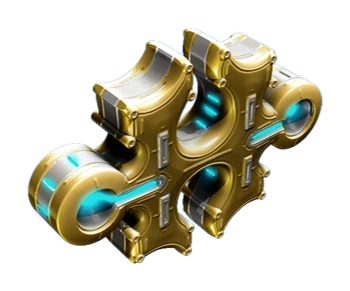

Forma, put simply, allows you to reset your piece of gear back to level 0, but with a polarity slot of your choosing. Nothing is lost other than the levels. Forma is both as strong as yet a little weaker than Catalysts, as the polarities it provides halve a mod’s cost.

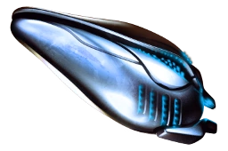

Affectionately referred to as potatoes by the community, blue Orokin Catalysts double the capacity of any weapon. These have a much greater initial effect than forma, but are much harder to come by. These should usually be saved for gear that you enjoy using.

Stance mods are special mods for Melee weapons that increase a weapon’s mod capacity. This boost is affected by polarities like normal, doubling the added capacity for a matching polarity, or having a decreased boost for a mismatched one.

## General Damage Mods

These mods are your build’s bread and butter. When you get them, they’ll tend to be what you should level first and foremost.

### Damage

There’s not much more to say, these mods give an increase to your damage, including elemental damage. These should be your main goal early game, though the higher levels can end up being more expensive than other mods and provide a smaller increase in power.

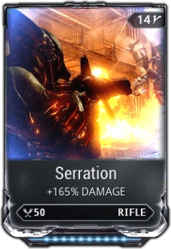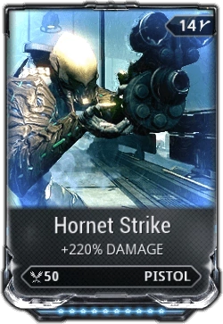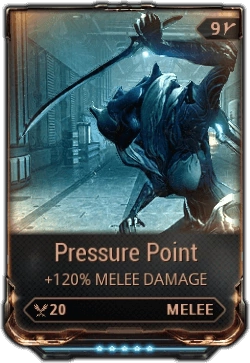

### Multishot

These are a little different. Multishot refers to the chance of a weapon to fire an additional bullet or shell with every shot. Going over 100% Multishot gives a chance to fire yet another bullet. Do note that Multishot on beam weapons only gives a chance to double dip on a damage tick, and doesn’t give a chance for an extra status proc like you would get for a weapon firing bullets. Instead, it just increases the status chance.

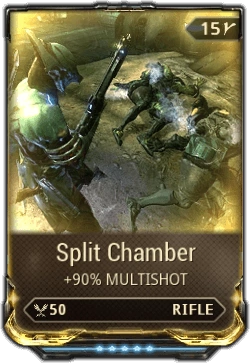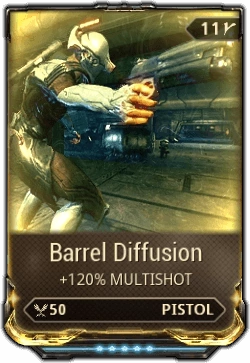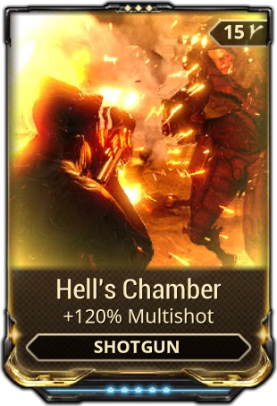

### Elemental

There’s eight major elemental mods for each weapon, but for now we’ll just focus on the four most basic ones. Elemental mods give damage consisting of one of four different base elements, being Cold, Heat, Toxin, and Electricity. This damage scales with the weapon’s modified base damage. These are your third best ways to increase damage outright, though they also help your weapons deal more \(or less\) damage to an enemy depending on its health/armor/shield type. In addition, you can mix two elemental mods together in order to make a new element that provides further bonuses against enemies.

|  | Toxin | Heat | Cold | Electricity |
| :--- | :--- | :--- | :--- | :--- |
| Shotguns | Contagious Spread | Incendiary Coat | Chilling Grasp | Charged Shell |
| Other Primaries | Infected Clip | Hellfire | Cryo Rounds | Stormbringer |
| Secondaries | Pathogen Rounds | Heated Charge | Deep Freeze | Convulsion |
| Melees | Fever Strike | Molten Impact | North Wind | Shocking Touch |

### 

### Combo Counter

Combo counter mods are only present on melee weapons and aren’t technically damage mods, but it’s important to familiarize yourself with them before diving into melee builds.

#### **Combo duration**

Combo Duration mods are quite simple in that they give you a longer grace period between hitting an enemy. Blood Rush and Weeping Wounds builds appreciate having these mods.

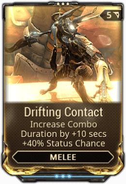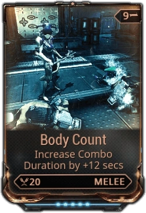

#### **Bonus Combo Chance**

While they can be a little difficult to fit into builds, these mods can make building your combo counter much faster. In my experience, Quickening is very handy to have, while True Punishment is a little more restrictive, but quite strong.

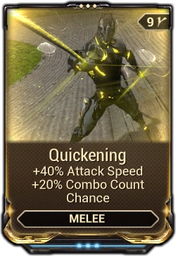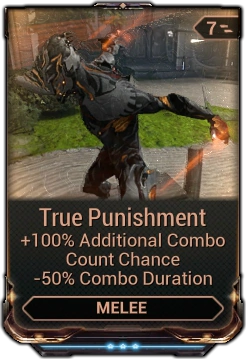

While the former two mods allow you to build your combo faster, Corrupt Charge allows you to simply start at a higher combo counter at all times. This can be a little tricky to fit into most builds, but can be helpful for Heavy Attack builds.

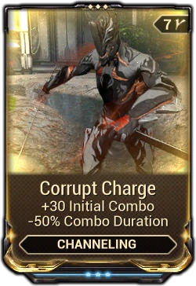

## Weapon Strategies

All weapons have both a Status Chance and a Critical Chance \(and a Critical Multiplier to go with it\). While raw damage will be able to carry you through the very early game, you’ll likely eventually end up needing to build your weapon for one \(or both\) of those strategies.

### Raw Damage Builds

Raw Damage builds look nice at first, as you can certainly pump a lot of damage into weapons that, sure, would make them do more damage at base than either of the other two, but these builds lack a lot of staying power as you progress through the game as armor and health values increase with the enemy’s level. That being said, though, these are going to be the go-to for most weapons you’ll find in the early game, as some of the necessary mods can be hard to find. Fortunately, by the time these builds start to fall off, you’ll likely have many of the necessary tools at your disposal to craft a more advanced build.

### Critical Focused Builds

Critical Hit builds, or Crit builds for short, are the simplest of the two. Simply speaking, these builds deal with your chance to score a critical hit, as well as the multiplier that will be applied when you do score one.

#### **Crit Chance**

Before we move on, it is important to note that there’s multiple levels of Crits. A normal, or yellow crit just multiplies the gun’s damage by the crit multiplier. However, if your crit chance is above 100%, not only will you always yellow crit, but you’ll also have a chance for an orange crit, which will cause that shot to have the crit multiplier to be applied _again_. It doesn’t stop there, though. If you have a Crit Chance of over 200%, you’ll always score an orange crit on top of the original yellow crit, and you’ll also have a chance for a red crit. Red crits, you guessed it, apply the crit multiplier again. That being said, the vast majority of the time you’ll need some help from crit chance sources outside of your build to even hit orange crits reliably, though melee weapons specifically have a few tricks up their sleeves.

#### **Crit Chance Mods**

These are your bread and butter for crit builds. It doesn’t matter how high the crit multiplier is if you can’t reliably proc a crit. While sure, there are _some_ ways to force a crit, they’re either unreliable, clunky, or both. Therefore, you’re going to need at least one crit chance mod as well as a reasonable base crit chance and crit multiplier. The “minimum” recommended crit chance varies by both weapon type and personal taste, though around 15-20% can be workable, with 25%+ being preferable for most weapons.

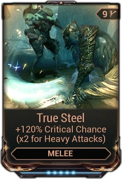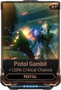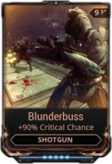

#### Crit Damage Mods

Now that we have crit chance out of the way, we get to the fun part: Just how high can you push your crit damage? The answer is… Pretty high, actually. Much like crit chance, crit damage has one basic mod for each of the four weapon types.

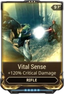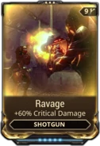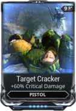

#### Melee Crit Builds

Finally, we get to melee builds. These builds are much different than those for guns, and as such, do require a little more investing in more uncommon mods. That being said, the result normally ends in a devastatingly strong weapon always at an arm’s reach. There’s a couple different strong crit builds for melee: Blood Rush builds and Heavy Attack Builds.

#### Blood Rush

The main goal of Blood Rush builds revolves around Berserker and Blood Rush. Berserker is a rare mod that increases attack speed when you score a critical hit, while Blood Rush increases a weapon’s crit chance as the melee combo counter ticks up. Scoring a crit will cause you to attack faster, which means you’re increasing the combo counter faster, which means you’re critting more often due to Blood Rush, which in turn allows you to attack faster and faster \(to a point\). It’s a very powerful build as is, and is one of the only reliable ways to consistently see red crits without help from outside your build. Because the crit chance increase can be volatile due to the combo counter decaying, these builds universally rely on some form of combo counter duration mods in order to give yourself more leeway in between engagements.

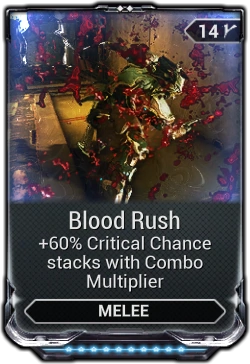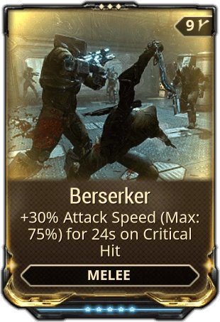

#### Heavy Attack

Heavy attack builds sacrifice the ability for strong continuous attacks for slower, much more powerful attacks. These builds forsake building the combo counter, but have enough impact to give them a powerful attack without having to build up your counter. As you don’t use the combo counter, you use the much easier to get True Steel or Sacrificial Steel mods for your crit chance, which offer TWICE their effect to heavy attacks. Despite using basic crit mods, heavy attack builds have no lack of uniqueness. They have quite an array of useful mods to increase their damage \(Killing Blow, Corrupt Charge\) or attack speed \(Killing Blow, Amalgam Organ Shatter\)

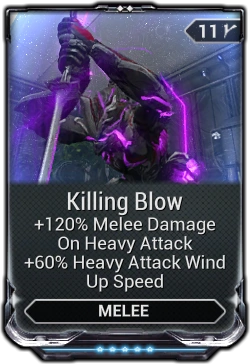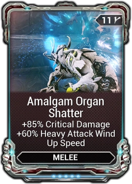

### 

### 

### 

### Status Based Builds

While crit builds are all about boosting your damage to ridiculous heights to overwhelm armor, Status builds instead seek to bypass it in a few different ways. The minimum recommended status chances do still vary by weapon type, though ~20% for melee, secondaries, and non-sniper or shotgun primaries is usable, while ~25% or more is good for snipers. Shotguns are unique in that each pellet fired can proc status, but they have an all around lower status chance. Around 10% status chance or so per pellet is fine for shotguns.

Just like crit chance, status chance now also has an effect when boosted to above 100%, simply giving you a guaranteed status proc every 100%, with a chance to have another. For example, if I had a weapon with a total of 316% status chance, I will always have three status procs and a 16% chance of getting a fourth proc.

#### Status Chance Mods and 60/60s

Fortunately, status builds start fairly simple as they only really require you to pick up a set of mods for each of the four weapons types. These mods are fairly low drain, offer great status chance, and provide elemental damage to boot. Because they all offer 60% status chance and 60% elemental damage, they’re commonly referred to as 60/60s. Once you get these mods, it’s as easy as just leveling them and tossing them into a build alongside any other damage mods.

|  | Toxin | Heat | Cold | Electricity |
| :--- | :--- | :--- | :--- | :--- |
| Shotguns | Toxic Barrage | Scattering Inferno | Frigid Blast | Shell Shock |
| Other Primaries | Malignant Force | Thermite Rounds | Rime Rounds | High Voltage |
| Secondaries | Pistol Pestilence | Scorch | Frostbite | Jolt |
| Melees | Virulent Scourge | Volcanic Edge | Vicious Frost | Voltaic Strike |

#### What do Status Procs Even do?

Now we’re _really_ heading down the rabbit hole. Every damage type in the game has some effect that it will apply when it is chosen as a status proc. All three physical damage types, all four basic elemental types, and all six combined damage types each have their own unique effect when procced. There’s a lot of depth to builds when it comes to these, so I would recommend looking into them more once you get a good idea as to what you’re doing. To start with, Viral + Heat is a popular pick.

#### What Status Effect am I Even Going to Proc?

Here’s where we start getting into some scary math. Status procs are randomly selected from your current damage types. While you can certainly use a couple formulas to actually determine the exact chance that a proc will be what you want, it’s generally easier to just remember this simple phrase: “More good: Good”.

#### The Melee Exception

This time around, melee builds are much much simpler, yet they still have their own little trick, in the form of Condition Overload. Condition overload is a mod that increases your melee damage by 120% for every unique status effect currently affecting the target. These builds can also be supplemented by the use of Weeping Wounds, if you are looking for a higher status chance as well.

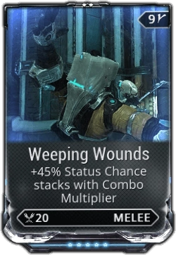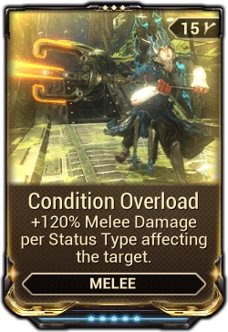

### Can I use Both?

If _both_ sets of stats are fairly high, as is the case for the Vectis sniper rifle, you can ignore the choice all together and create a very effective hybrid build simply using the two basic crit mods and enough 60/60s in order to reach a status chance you’re comfortable with.

### Which Build Should I Use?

The ultimate choice as to what build you should use largely lies in both personal preference and weapon status or critical stats. Though, even if a specific build or weapon is powerful, that means nothing if you personally don’t enjoy that build type, weapon gimmick, or even weapon category. Therefore, before you heavily invest in a weapon, you should make sure to take the time and acquaint yourself with the weapon, and get a feel as to whether or not you could see yourself using this weapon for hours of play time once you put the time and resources into leveling it.

## Other Mods

### “Noob Trap” Mods

Mods referred to as “Noob Traps” are mods that, while they _can_ be handy if you have nothing better, have fairly easy to obtain alternatives that are much better. These mods may look okay at first glance, but typically either don’t have high enough numbers or are just too niche.

#### **Low % IPS Mods**

These mods are incredibly common, though due to their really low to okayish percentages, will typically drop out of builds very quickly. While the 120% IPS mods do have their niches, 30%, 60%, and even 90% IPS mods are outclassed by 90% elemental mods nine times out of ten. These will be helpful early game, but will tend to be the first mod you should cut to make room for stronger mods.

#### **Ammo and Magazine Related Mods**

Max Ammo mods don’t really bring a whole lot to the table, especially when the latter is largely outclassed by both another Ammo mod as well as a Sentinel, meaning that it gets much more difficult to validate a place for it in a build. Do note, though, that Ammo Drum specifically is commonly used as the go-to filler item for giveaways.

Magazine Capacity mods, while they do let you lay down suppressing fire for longer, don’t make that suppressing fire hurt any more, meaning that they are also hard to validate.

Ammo Mutation mods used to be hard to justify, but with the introduction of Exilus slots for guns, they no longer require you to sacrifice damage for ammo.

#### **Pure Punch Through Mods**

While Punch Through \(Or PT\) mods do help you take on hordes a bit better, their extremely high cost \(usually 15 points at max level\) makes it very hard to fit them into builds.

#### **Bane Mods**

Any mod that adds damage against a single faction already has an obvious weakness. These are useful early game, but replacing them with more consistent sources of damage asap is a good choice.

### Niche Mods

These mods aren’t as widely used as the rest, but they do hold some useful niches nonetheless.

#### **120% Impact, Puncture, and Slash Mods**

These can be a _little_ misleading at first. The larger percentages would imply a larger damage boost compared to the 90% increase of status mods. However, because these mods scale based on only one single damage type, the damage granted by these mods only exceeds that of a 90% Elemental mod when the affected damage type makes up 75% or more of a weapon’s base damage. Nevertheless, these can be particularly useful for status weapons that rely on Slash damage, allowing you to increase the chance of the weapon proccing Slash.

#### **Reload Speed Mods**

Increasing a weapon’s reload speed usually isn’t particularly worth it, though some weapons do appreciate it. The Vectis is a common user of these, as having to reload after every shot can be a pain. Others, like the Tigris family, Twin Rogga, Angstrum, and more either have really small magazines that cause them to reload a lot, dump their entire magazine with one attack, or both. The Vectis Prime also tends to use Depleted Reload in order to get back to a single shot magazine.

#### **Fire Rate Mods**

Fire rate mods are kind of hard to tell. On the one hand, they don’t make your shots do any more damage, on the other hand, you’re shooting more shots, on the _other_ other hand, they make your weapon eat up ammo faster. These mods not only increase fire rate, but also decrease charge time, spin up time, and increase the fire rate of each shot in a burst weapon’s burst in addition to the fire rate of bursts in general. While their increases aren’t as big as pure fire rate mods, Shred offers the bonus of a bit of Punch Through, while Lethal Torrent offers some multishot. Vile Acceleration is also a commonly used fire rate mod on very heavy hitting weapons with long charge times, like the Lanka or Opticor.

#### **+Damage -Accuracy Mods**

These corrupted mods offer a great increase in damage, though at quite the frustrating price for many guns. Even though you are doing more damage per shot, your weapon’s newfound tendency to send shots careening off course can lead to you actually end up doing less damage than you would without it. Regardless, some weapons can make do with it. Beam weapons in particular always have pinpoint accuracy, making this a free damage boost. There are some other weapons that can use it with little negative effect, though. Quartakk, for example, goes from a pinpoint four-shot burst rifle to more of a shotgun sort of weapon. Heavy Caliber for rifles is the best of these, with Vicious Spread being okay for Shotguns, and Magnum Force not being advisable at all, due to it having an objectively better alternative.

## Conclusion

That just about covers it, then. It’s a lot of information, to be certain, but after a while you’ll be able to whip up a build in no time flat. Of course, don’t be afraid to experiment a little. Just because a mod isn’t mentioned here doesn’t mean that it isn’t useful at all. Builds do still come down to personal taste a majority of the time, so I encourage you to try builds out for yourself in order to really get a feel as to what your playstyle is in Warframe.

## Terms to Know

**IPS** - Impact/Puncture/Slash, the three primary damage types

**Tick** - A single instance of damage from a damage over time effect

#### DOT - Damage over time

